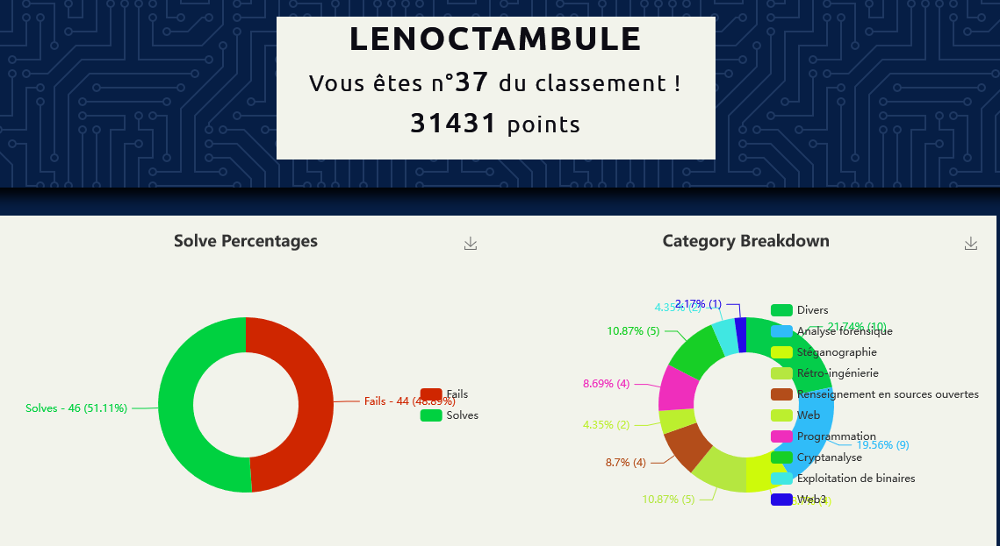

# 404CTF 2022

Those are the write-ups of the challenges I solved for 404CTF 2022 organized by TelecomSudParis's cybersecurity club HackademINT & DGSE. I really had a blast doing this CTF while at the same time rediscovering french history.

**Rank** : 37th / 2460  
**Points** : 31431

I've decided to make a write up only for the challenges I found interesting to write on. They are highlighted in blue.

## Solved challenges

### Forensics :

* Floppy
* Ping Pong
* [Agent Compromis 1/3](https://github.com/lenoctambule/ctf-writeups/blob/main/404ctf/forensics/agent_compromis_1)
* [Agent Compromis 2/3](https://github.com/lenoctambule/ctf-writeups/blob/main/404ctf/forensics/agent_compromis_2)
* [Agent Compromis 3/3](https://github.com/lenoctambule/ctf-writeups/blob/main/404ctf/forensics/agent_compromis_3)
* SOS RAID 1/2
* SOS RAID 2/2
* [Hackllebarde Ransomware 1/4](https://github.com/lenoctambule/ctf-writeups/blob/main/404ctf/forensics/hackllebarde_1)
* [Hackllebarde Ransomware 2/4](https://github.com/lenoctambule/ctf-writeups/blob/main/404ctf/forensics/hackllebarde_1)

### Coding :

* [128Code128](https://github.com/lenoctambule/ctf-writeups/blob/main/404ctf/prog/128Code128/code128.md)
* [Données corrompu](https://github.com/lenoctambule/ctf-writeups/blob/main/404ctf/prog/corrompu/corrompu.md)
* Découpé
* Compression

### Pwn :

* Trop facile
* [Sans protection](https://github.com/lenoctambule/ctf-writeups/blob/main/404ctf/pwn/sans_protection/exploit.py)

### Crypto :

* un RSA incassable 
* Un simple oracle 1/2
* Un simple oracle 2/2
* La fonte des hashs
* Weak Signature 

### Misc :

* Pierre-papier-hallebarde
* Je suis une théière
* Par cable
* Gogolfplex
* [Un utilisateur suspiceux 1/2](https://github.com/lenoctambule/ctf-writeups/blob/main/404ctf/misc/utilisateur_suspicieux/utilisateur.md)
* [Un utilisateur suspiceux 2/2](https://github.com/lenoctambule/ctf-writeups/blob/main/404ctf/misc/utilisateur_suspicieux/utilisateur.md)
* [8 Vers 10](https://github.com/lenoctambule/ctf-writeups/blob/main/404ctf/misc/8vers10/8vers10.md)

### Reversing : 

* Mot de passe ?
* [Renverser la tour 1/2](https://github.com/lenoctambule/ctf-writeups/blob/main/404ctf/reverse/tour_1)
* [Renverser la tour 2/2](https://github.com/lenoctambule/ctf-writeups/blob/main/404ctf/reverse/tour_2)
* [Mise à jour requise](https://github.com/lenoctambule/ctf-writeups/blob/main/404ctf/reverse/maj_requise)
* [Pas de mise à jour](https://github.com/lenoctambule/ctf-writeups/blob/main/404ctf/reverse/pas_de_maj)

### Steganography :

* Plume à la main 
* [Stereographie](https://github.com/lenoctambule/ctf-writeups/blob/main/404ctf/steg/stereographie/stereographie.md)
* PNG : Un logo obèse 1/4
* PNG : Drôle de chimère 2/4
