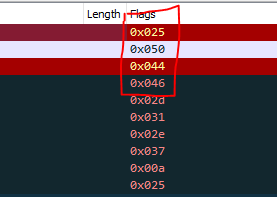

# Hackllebarde

## Task
We are given packet capture of suspicious network traffic and we have to find out what information was exfiltrated

## Process

First, we yeet out everything else except the requests that are being sent out to port 1337 with this filter :
```
tcp.dstport == 1337
```

Then we notice that the flags are pretty eratic so we can safely assume that the data is exfiltrated through the flag of the TCP request. 



So we add it as a column and we notice as seen above that the first 4 bytes corresponds to a pdf file signature. So we export it as a csv and then run this python script to reconstruct the file :

```python
f = open("data-hex.txt", "r")
data = f.read()
data_bytes = bytes.fromhex(data)

with open("./doc.pdf", "wb") as bin_file :
    bin_file.write(data_bytes)
```
Flag : 404CTF{L3s_fL4gS_TCP_Pr1S_3n_fL4G}

