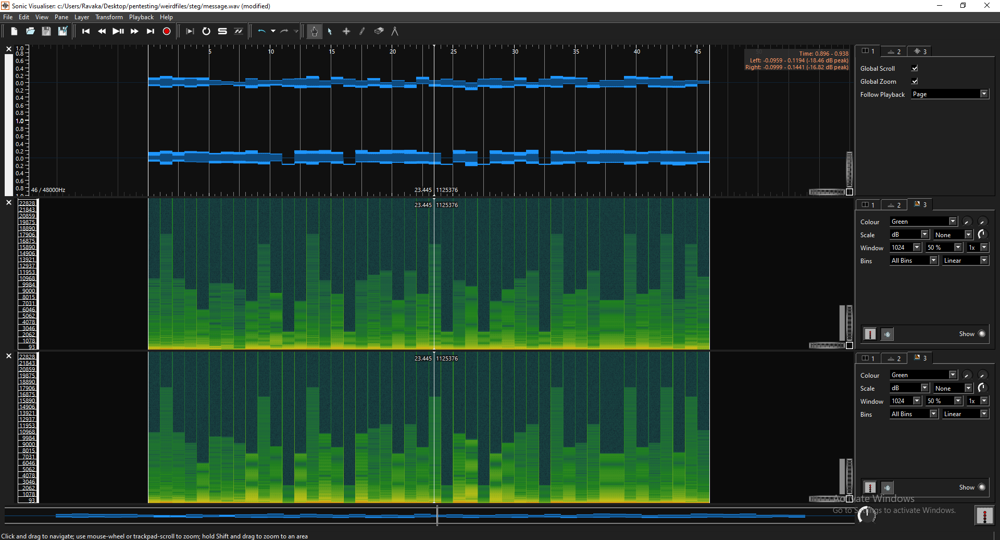
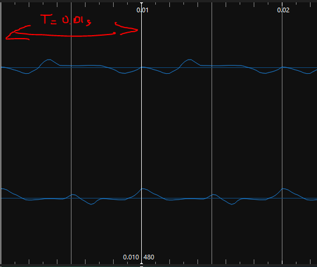
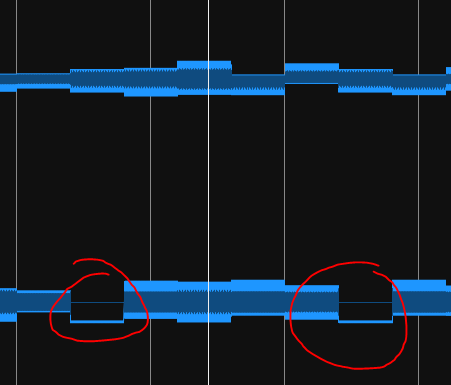
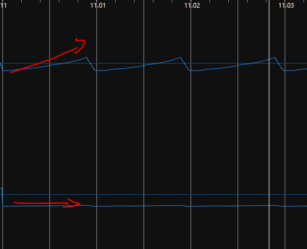
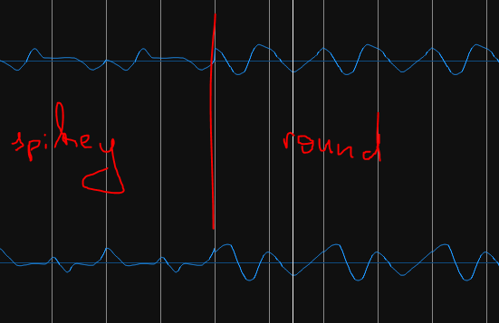

# Stereography : I can hear pictures now

## Intro

This challenge sent me into a lot of dead ends (too many to write them all in there). So for this challenge I'll go straight to the answer but I'll still try to go into detail on how I found it.

## Task

Pretty straight forward. A strange message by Hallebarde has been intercepted. Find the flag inside the file.

## Process

We are given a WAVE file named message.wav. So we can start inspecting it by using the file command on it :

```console
ubuntu@ubuntu-acer:~/ctf/steg/stereo file message.wav
message.wav: RIFF (little-endian) data, WAVE audio, Microsoft PCM, 16 bit, stereo 48000 Hz
```

And we have two useful information here : it has 2 channels and the bitrate is 48 000.
So we try to play it and it sounds like digital modulation. So we open it in Sonic Visualizer to try to identify it.



Well from the spectrogram it doesn't look like or sound like anything I've seen or heard before. Zoomed in there are those periodic 10ms signals that changes every 1 second.



Notice that the first and third chunks are identical and we know that the flag format is : 404CTF{flag}. So we know that one chunk holds one letter of our flag. After 1 hour of losing myself into the RF section of wikipedia and questioning life choices, I finally noticed something !



Those look like underscores ! And this is where everything becomes clear.



Channel 2 is constant and Channel 1 is linear and increasing.



Moreover if we look at the first and second chunk. The first signals looks spikey like the 4 it is supposed to represent and the second is rounder just like the 0 it is supposed to represent.

And bingo ! The title even confirms my intuition : we can now assume that Channel 1 is X and Channel 2 is Y and the letters are drawn every 0.010s (which represents 400 frames) and the letter drawn changes every 1s. Now we know that we have to write a python script that draws those out. And here it is :

```python
from scipy.io.wavfile import read
import matplotlib.pyplot as plt
import numpy as np


data = read("message.wav")
print(type(data[1]))
for i in range(46) :
    plt.clf()
    plt.xlim(-7000,7000)
    plt.ylim(-7000,7000)
    plt.autoscale(False)
    s_start = i*48000
    s_end = i*48000 + 400
    plt.plot(data[1][s_start:s_end,0],data[1][s_start:s_end,1])
    plt.savefig('char-'+str(i)+'.png')
```
**Warning :** This script will output 46 pngs in the directory it is executed in

And if we look at the outputs of our script, we get the flag letter by letter :
```
404CTF{AV3Z_V0U5_U71L153_UN_VR41_05C1LL05C0P3}
``` 